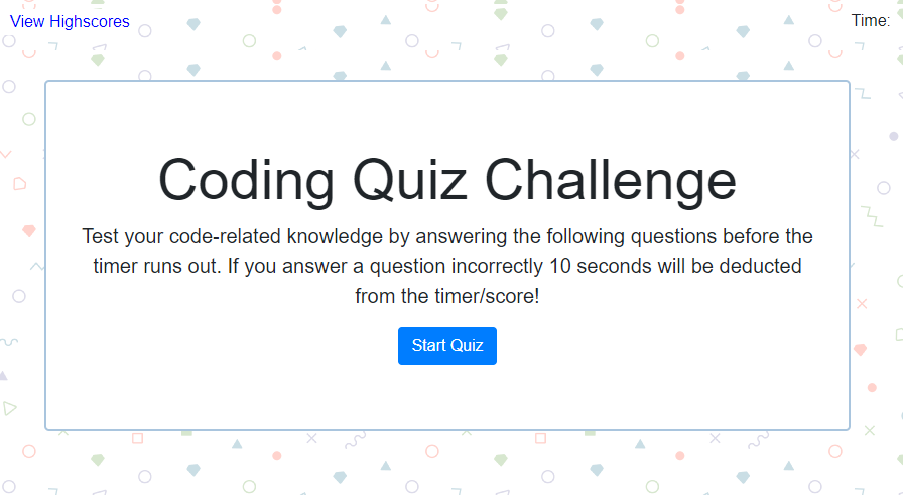

# My Portfolio

## Table of contents
* [General info](#general-info)
* [Technologies](#technologies)
* [Screenshot](#screenshot)
* [Credits](#credits)
* [License](#license)

## General info
This project is a timed quiz that tests the user's code-related knowledge. It consists of 5 total questions and gives the user a total of 75 seconds to answer the 5 questions giving them 15 seconds for each, however if the incorrect answer is selected 10 seconds are deducted from the timer. The users score is the time remaining once they get to the last question or if the timer gets to 0. The user inputs their initials to save their score locally on a highscore list with up to 10 of the highest scores. The highscore list can also be cleared via clearing the local storage. I put the questions in a separate javascript file which allows for additional questions to be added to the quiz if desired.  
	
## Technologies
This project is created with: 
* Bootstrap 4
* CSS
* HTML:5
* JavaScript
* jQuery

## Screenshot

Link to my deployed github page: https://rachelrohrbach.github.io/homework-4/

# Credits
I consulted jQuery API Documentation (https://api.jquery.com/), W3Schools (https://www.w3schools.com/js/default.asp), MDN Web Docs (https://developer.mozilla.org/en-US/docs/Web/JavaScript), and Bootstrap 4 (https://getbootstrap.com/) extensively in creating my project. Some other resources that I used include: Stack Overflow (#https://stackoverflow.com/) and the GitLab repository for my course, specifically referencing the in-class activities. 

## License
MIT License

Copyright (c) [2019] [Rachel Rohrbach]

Permission is hereby granted, free of charge, to any person obtaining a copy
of this software and associated documentation files (the "Software"), to deal
in the Software without restriction, including without limitation the rights
to use, copy, modify, merge, publish, distribute, sublicense, and/or sell
copies of the Software, and to permit persons to whom the Software is
furnished to do so, subject to the following conditions:

The above copyright notice and this permission notice shall be included in all
copies or substantial portions of the Software.

THE SOFTWARE IS PROVIDED "AS IS", WITHOUT WARRANTY OF ANY KIND, EXPRESS OR
IMPLIED, INCLUDING BUT NOT LIMITED TO THE WARRANTIES OF MERCHANTABILITY,
FITNESS FOR A PARTICULAR PURPOSE AND NONINFRINGEMENT. IN NO EVENT SHALL THE
AUTHORS OR COPYRIGHT HOLDERS BE LIABLE FOR ANY CLAIM, DAMAGES OR OTHER
LIABILITY, WHETHER IN AN ACTION OF CONTRACT, TORT OR OTHERWISE, ARISING FROM,
OUT OF OR IN CONNECTION WITH THE SOFTWARE OR THE USE OR OTHER DEALINGS IN THE
SOFTWARE.